# Jarvis — architecture & stack

This document is the **reference for how the system is organized**: Rust workspace, assistant runtime, GUI, resources, and the **planned** LLM layer. It merges **implemented layout** (`crates/`, `frontend/`, `resources/`) with **target stack decisions** (llama.cpp, routing, differentiation).

---

## Executive summary

**Jarvis** is a **cross-platform** offline-first assistant: **Tauri + Svelte** for settings and control, **`jarvis-app`** for the always-on **mic → wake → Vosk STT → intent/slots → commands (Lua / manifests / platform helpers)** loop, with **WebSocket IPC** between them. **Extension** is **data-driven** (`resources/commands/`) and **scriptable** (Lua sandbox). **Feedback** uses **prerecorded voice packs** for low-latency persona. **Planned:** a **unified LLM facade** with **llama.cpp** (**local + HTTP**), **OpenAI-compatible** HTTP for **Ollama / cloud**, **tool calling** into the same command surface, and a **fast path** that avoids LLM tokens for common turns.

---

## 1. Reference stack (layers)

| Layer | Technology | Responsibility |
|-------|------------|----------------|
| **UI shell** | Tauri 2 + **Svelte** + Vite | Settings, command browser, spawn/monitor assistant, `invoke` for local ops |
| **UI ↔ assistant live** | **WebSocket** `127.0.0.1:9712` | `IpcEvent` / `IpcAction` — state, recognition, typed commands, stop |
| **Assistant process** | **`jarvis-app`** (Rust) | Tray (non-macOS), main loop, models on hot path |
| **Shared library** | **`jarvis-core`** | Audio, recorder, wake, Vosk, intent, slots, commands, Lua, IPC, voices, db, i18n, models registry |
| **Classical NLU** | Embeddings / classifier + optional slot models | Map transcript → command id + args **without** LLM when confident |
| **Planned LLM** | **Facade** → in-process **llama.cpp** **or** HTTP (**llama-server**, Ollama, OpenAI-shaped APIs) | Reasoning, disambiguation, tool calls when fast path abstains |
| **Execution** | Lua API, YAML/TOML manifests, AHK (Windows), etc. | Run user-facing **command packs** under `resources/commands/` |
| **Voice persona** | **`voice.toml`** + audio clips | `Reaction` enum → play clip (not generative TTS by default) |
| **On-disk** | `resources/` (commands, vosk, models, voices, keywords) | Ship or download assets; paths resolved from app dir |

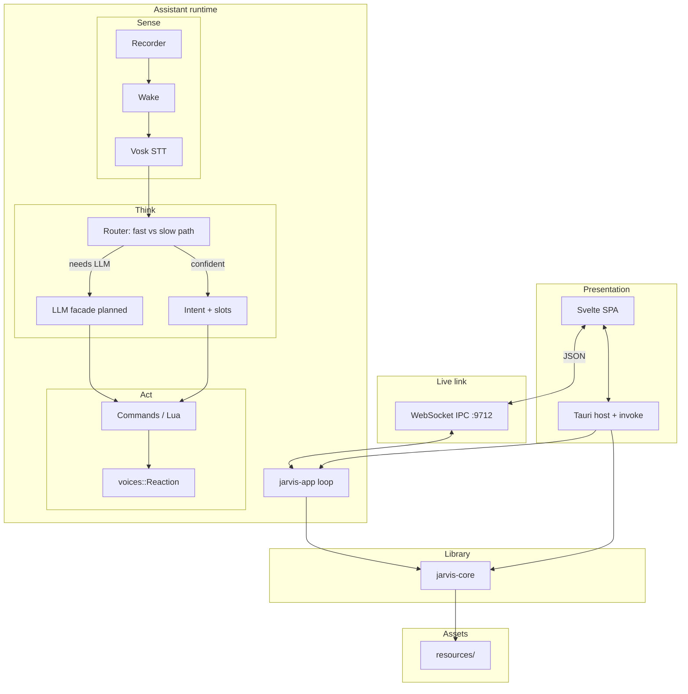

---

## 2. Design principles

1. **Offline-first by default** — STT, wake, intent, and command execution work without cloud; LLM hosts may be **local** (llama.cpp / Ollama on loopback) or **opt-in remote** OpenAI-compatible APIs.
2. **Split control plane and data plane** — **GUI** stays light; **assistant** owns mic, heavy models, and the main loop.
3. **One LLM abstraction** — Callers use a single Rust API (`chat` + optional **tools**); backends are **embedded llama.cpp**, **HTTP to llama-server**, or **HTTP to Ollama / other** — no duplicate orchestration logic.
4. **llama.cpp is mandatory to support** — **Local** (bindings or loopback `llama-server`) **and** **HTTP** to `llama-server` / compatible proxies.
5. **Fast path before LLM** — High-confidence intent → execute + **`voices::play(Reaction)`** + IPC; **no completion tokens** for that turn.
6. **Minimal tool / prompt surface** — Small schemas, enums (e.g. `play_reaction`), lazy `list_commands` / `search_commands` — keep prompts cache-friendly and cheap.
7. **Extensibility over fixed menus** — Command packs + Lua, not only a builtin command count.
8. **Safer than raw shell-from-LLM** — Prefer **manifested commands** and **sandboxed** scripting; capability tiers as a follow-on.

---

## 3. Workspace crates

| Crate | Role |
|-------|------|
| **jarvis-core** | Shared library: audio, recorder, wake listener, Vosk STT, command parsing, Lua sandbox, ONNX/embeddings + intent, slots, IPC primitives, voices, DB/config, i18n, models registry. **Feature-gated** for slim GUI builds. |
| **jarvis-app** | Assistant process: mic loop, wake, VAD, STT, intent → execution, WebSocket server, tray (non-macOS). |
| **jarvis-gui** | Tauri shell: settings, commands UI, starts `jarvis-app`, `invoke` + WebSocket. |
| **jarvis-cli** | Test intent / list commands / simulate execution without full GUI or mic loop. |

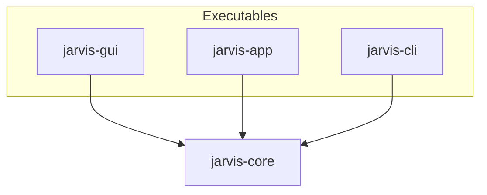

Root **`Cargo.toml`** defines workspace members and shared dependency versions.

---

## 4. System context & processes

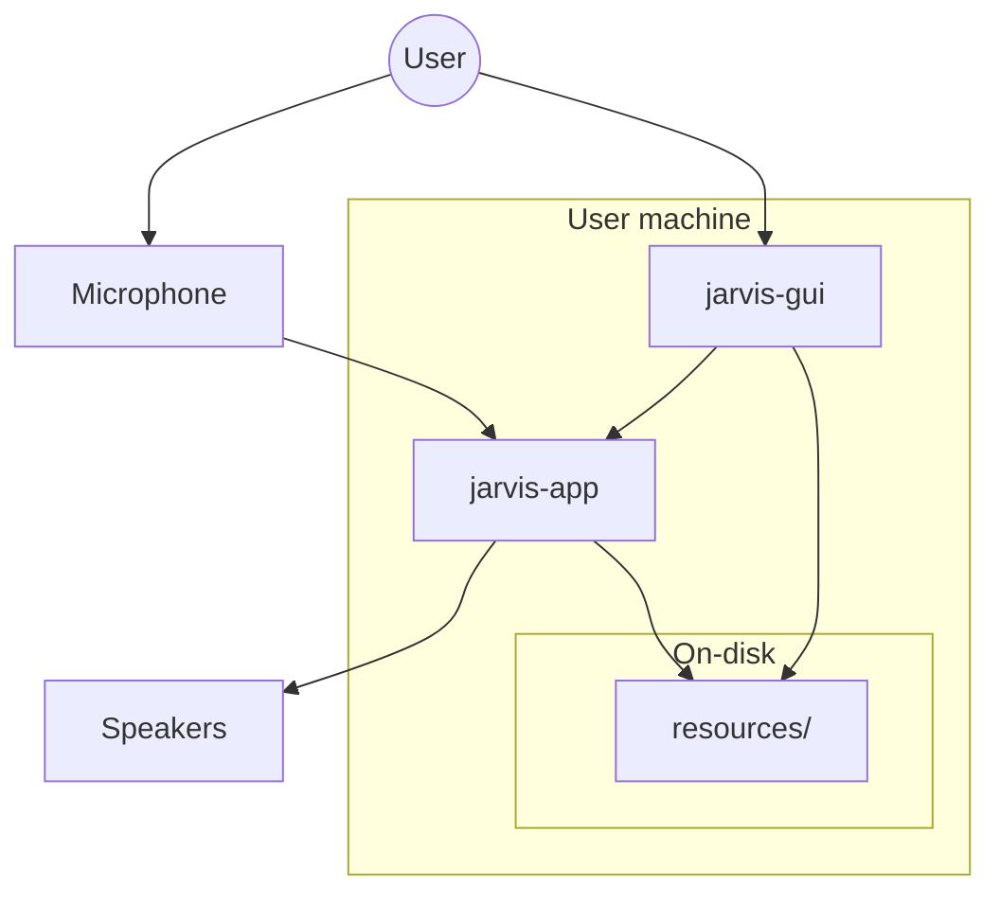

- **`jarvis-app`** owns capture, models, and the hot path.
- **`jarvis-gui`** persists **settings**, may **spawn** the assistant, and subscribes to **live events** over the socket.

### Two processes, two GUI channels

| Channel | Mechanism | Use |
|---------|-----------|-----|
| **A** | Tauri **`invoke`** → `tauri_commands::*` → slim **jarvis-core** | Settings, files, devices, i18n, voice list, launch assistant |
| **B** | **WebSocket** ↔ `jarvis-app` | Listening state, last transcript, errors, **typed command** injection |

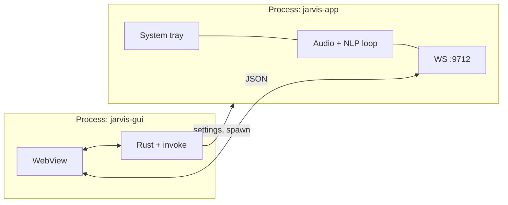

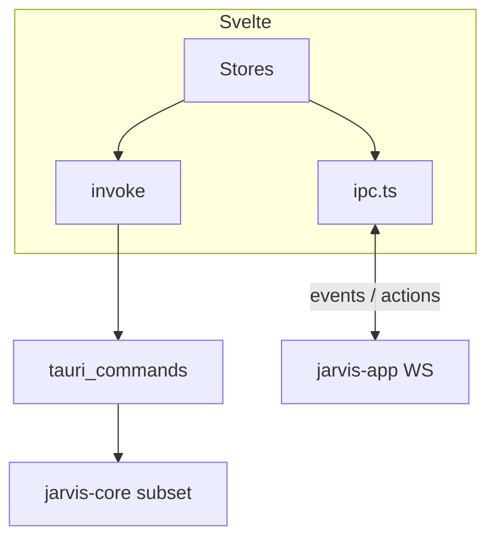

**macOS:** tray may be limited; loop + IPC can still run.

### IPC direction

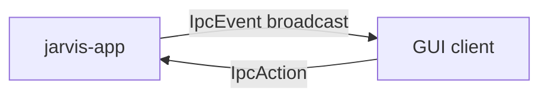

Implementation: `crates/jarvis-core/src/ipc/`, `frontend/src/lib/ipc.ts`.

---

## 5. `jarvis-core` modules (logical)

Names mirror `crates/jarvis-core/src/`. Several modules are behind **`jarvis_app`** (or other features).

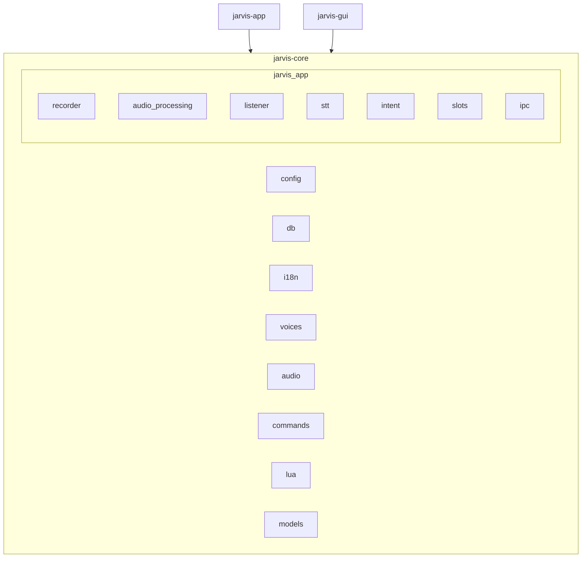

**jarvis-gui** typically depends on core **without** `jarvis_app` so the Tauri binary does not embed the full mic/STT stack.

### Feature flags (summary)

- **`jarvis_app`** (default for app) — Vosk, intent, ONNX/tokenizers, IPC, Lua, nnnoiseless, etc.
- **`intent`** — Intent-only subset.
- **`lua` / `lua_only`** — Scripting + deps used by Lua APIs.

---

## 6. Speech & command pipeline (`jarvis-app`)

Implemented flow (`crates/jarvis-app/src/app.rs`):

1. **Recorder** — PCM from selected device.  
2. **Audio processing** — Noise / VAD hints.  
3. **Wake** — Rustpotter / Porcupine / Vosk paths in `listener/`.  
4. **Ring buffer** — Pre-roll before VAD flush.  
5. **VAD-style segmentation** — Bound utterance for STT.  
6. **STT** — **Vosk** → text.  
7. **Intent + slots** — Embeddings/classifier + optional slot extraction.  
8. **Execution** — `resources/commands/` → Lua / manifests / platform helpers.  

**IPC** updates the GUI at key steps. **Text commands** from the GUI skip mic via **`IpcAction::TextCommand`**.

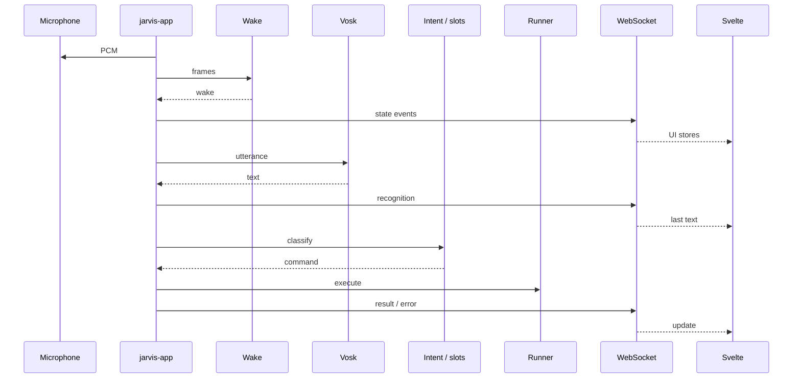

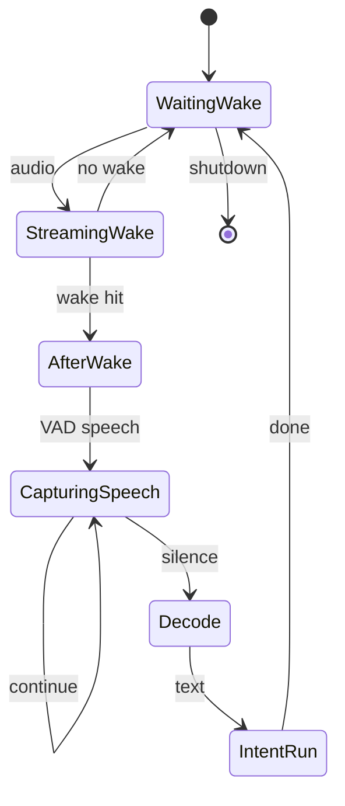

---

## 7. Intelligence layer: classical NLU + planned LLM

### Router (target behavior)

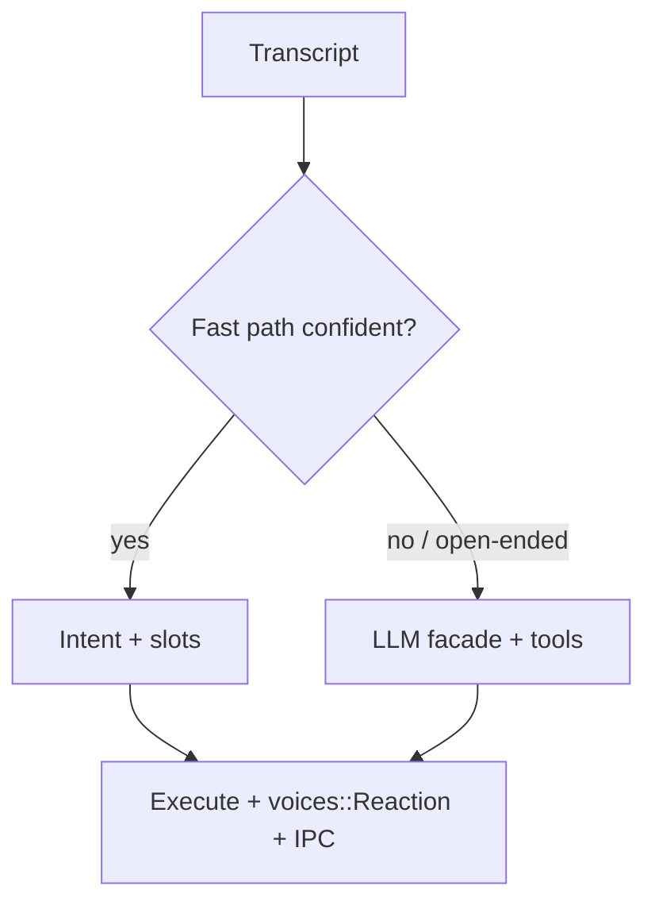

### LLM backends (**llama.cpp required** + OpenAI-shaped HTTP)

**Must support [llama.cpp](https://github.com/ggerganov/llama.cpp):**

1. **Local** — In-process (**Rust bindings / FFI**) **or** **spawned `llama-server`** on loopback.  
2. **HTTP** — Any **`llama-server`** (or compatible) at configurable **`base_url`**.

**Also:** one **OpenAI-compatible** HTTP client for **Ollama** ([docs](https://github.com/ollama/ollama/blob/main/docs/openai.md)), hosted APIs, and local/remote **llama-server** when using the HTTP API surface.

**Config:** `base_url`, optional `api_key`, `model` id.

**Rule:** HTTP backends share **one** request/response path; **embedded llama.cpp** implements the **same Rust trait/facade** (`complete_chat` + tools) so **router + tool dispatcher** stay backend-agnostic.

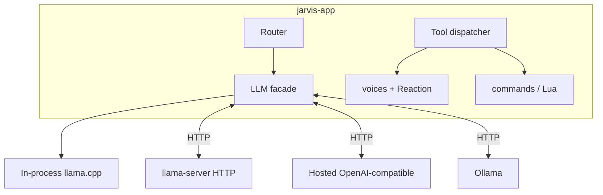

### Token & tool discipline

| Rule | Detail |
|------|--------|
| No LLM for cheap UX | **Prerecorded** reactions + templates when fast path wins. |
| Tools stay small | Short descriptions; **enums** (`play_reaction: ok \| greet \| …`); few tools. |
| Lazy command metadata | **`search_commands` / paginated `list_commands`** — never dump full tree in system prompt. |
| Static system prompt | Short, cache-friendly; volatile context in one user block or tool result. |

---

## 8. Voice & audio persona

### Implemented today

- **Voice packs:** `resources/sound/voices/<id>/voice.toml` maps **`Reaction`** variants to clip basenames per language (`crates/jarvis-core/src/voices.rs`).  
- **Playback:** `rodio` / `kira` in `audio`.  
- **Multiple personas** — Different packs = different actors/styles; switching is **config** (voice id), not a runtime TTS cost.

### Batch provisioning: advanced TTS → same clip folders (“bake”)

Use the **strongest TTS you can afford** (premium cloud, large local model, or a dedicated bake machine) **offline** to **render** every **common-response** line into the **existing pack layout**. Runtime stays **one optimized path**: load `voice.toml`, pick a basename, **`audio::play_sound`** — **no** TTS library in `jarvis-app` for those lines.

| Phase | What runs | Cost |
|-------|-----------|------|
| **Provision** (on demand) | Baker CLI / script / CI: reads a **manifest** (reaction id, locale, **source text**, output filename) → calls TTS → writes `resources/sound/voices/<pack>/<lang>/<name>.wav` (or mp3) | Paid API or heavy GPU **once per line per persona**; re-run when text or voice changes |
| **Runtime** | Same as today: `voices::play(Reaction)` | Decode + play only |

**When to bake**

- **New persona** — New folder `<pack_id>` + `voice.toml` + generated clips for all `Reaction` lists per language.  
- **Switch persona** — User selects another `voice.id` in settings; **no** generation at switch time if pack already baked.  
- **New common response** — Add a reaction key or clip list entry in `voice.toml`, extend manifest, **re-bake** that pack (or incremental bake for changed lines only).

**Manifest (recommended)** — e.g. `voice.manifest.yaml` beside `voice.toml`: rows like `reaction: ok`, `variant: ok3`, `locale: ru`, `text: "Слушаю"`, `out: ok3`. The baker is the **only** place that depends on the fancy TTS SDK; the assistant binary does not.

**Provenance (optional)** — `provenance.toml` in the pack: `tts_engine`, `model_id`, `voice_id`, date — so you can **reproduce** or **diff** packs without guessing how clips were made.

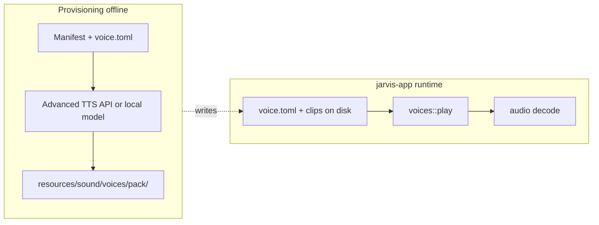

**Why this optimizes code**

- **Single playback implementation** for all “canned” speech — whether clips were **studio**, **Piper**, or **premium TTS**.  
- **No** runtime branch “if cloud TTS else clips” for common responses.  
- **Tier C live TTS** (§8) remains only for **dynamic** strings (slots, LLM), not for lines you can enumerate up front.

### Recommended stack: fast response + personas + cheap TTS

**Goal:** sub‑100 ms perceived feedback for common paths; **arbitrary spoken text** only when needed; **many personas** without paying LLM + TTS on every beep.

| Tier | Mechanism | Latency | Cost (typical) | Persona |
|------|-----------|---------|----------------|---------|
| **A — Clips** | Prerecorded WAV/MP3 per `Reaction` + optional per‑pack random choice | **Lowest** (decode + play) | Disk + decode only | **Full** — different packs = different actors |
| **B — Cached TTS** | Fixed strings (e.g. “Command not found”) synthesized once, stored by `(persona_id, lang, text_hash)` | Low after first hit | One synth per unique string | Same TTS **model + speaker** per persona |
| **C — Live local TTS** | **Long** or dynamic strings (slot values, LLM answers) via **long‑running TTS service** | Medium (warm GPU/CPU) | One loaded model; **no** per‑utterance cold start | **Speaker / model** selected per persona config |
| **D — Cloud TTS** | Optional; only if user enables | Network bound | **$$ per char** — use sparingly | API voice id per persona |

**Pipeline rule:** after **STT → router → execution**, choose output as:

1. If outcome maps to **`Reaction`** → **Tier A** (clips). **No STT→TTS round trip** for “OK”, “listening”, errors that have clips.  
2. If fixed template string without clip → **Tier B** (synth once, reuse file or memory cache).  
3. If user needs **novel text** (LLM reply, slot-filled sentence) → **Tier C** (or D if configured).

This keeps **fast path** aligned with **§7**: confident NLU → execute → **clips first**; LLM + long TTS only on **slow path**.

### TTS as a service (cost‑optimized)

- **Prefer one daemon** (Piper server, Coqui server, `speechd`, or a small sidecar) with **model loaded once** — avoid spawning a new process per sentence (cold start dominates latency and I/O).  
- **API:** HTTP or stdin IPC; request = `text`, `persona_id` → resolve to **onnx model path + speaker id** (Piper) or **voice id** (other engines).  
- **Streaming:** if the engine supports **chunked audio**, start playback before the full sentence finishes — improves **perceived** response time for Tier C/D.  
- **Personas** = **data**, not **processes**: table mapping `persona_id → { tts_backend, model_path, speaker_id, clip_pack_id }`. Clips and TTS share the same logical **persona** so the assistant sounds consistent.

### Speech & command pipeline (latency summary)

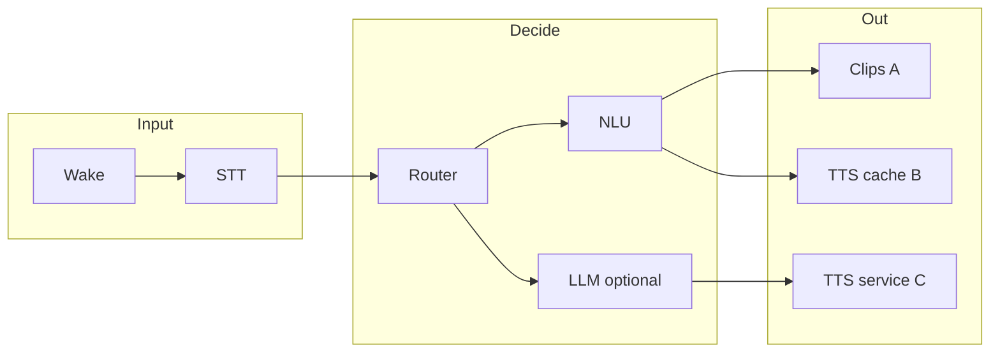

**STT side (already Vosk):** keep wake/STT **small models** where quality allows; optional **partial results** later for earlier routing (implementation‑dependent). **Do not** block clip playback on LLM completion.

### Cost dimensions to watch

| Dimension | Tactic |
|-----------|--------|
| **LLM tokens** | Fast path + short tools (§7). |
| **TTS compute** | Clips > cache > live; one warm service. |
| **Cloud $** | Off by default; cap length; Tier A/B first. |
| **Disk** | Clip packs per persona; cache dir with LRU for Tier B. |

---

## 9. Frontend & repository layout

- **Vite + Svelte** embedded in Tauri; routes: `index`, `commands`, `settings`.  
- **Resources:** `resources/commands/`, `resources/vosk/`, `resources/models/`, `resources/sound/voices/`, `resources/keywords/`, etc.

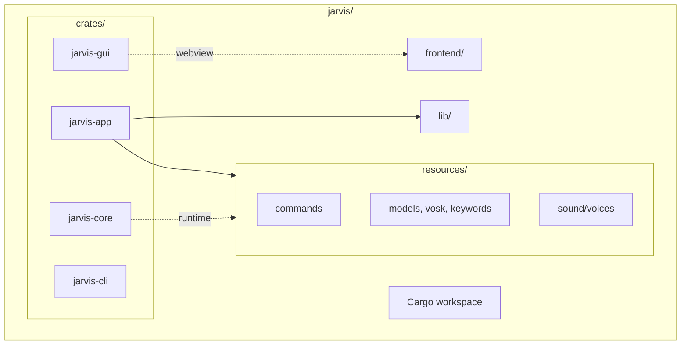

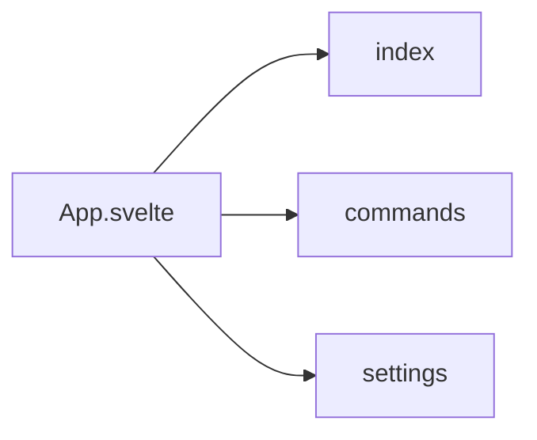

---

## 10. Configuration & state

- **`db` / `SettingsManager`** + global **`DB`** for language, voice id, model paths, API keys (e.g. OpenAI-shaped), etc.  
- **`config::init_dirs()`** early in each binary for config and log paths.

---

## 11. Extension points

- **Commands** — New folder under `resources/commands/` with manifest + scripts.  
- **Voices** — New pack directory + `voice.toml` + audio files.  
- **Locales** — Fluent bundles, Vosk models, voice pack language sections.  
- **LLM** — New backend = implement facade + config row (no change to router contract).

---

## 12. Known gaps (implementation vs this doc)

| Gap | Notes |
|-----|--------|
| **LLM facade** | Described here; **not yet** wired through `jarvis-app` main loop. |
| **IPC** | **Reload commands**, **mute** may be stubbed. |
| **macOS tray** | Unsupported in tray module; GUI may still run. |
| **TTS** | README: generative TTS not primary; **clips** are. |

**Actionable backlog:** [`design/ROADMAP.md`](ROADMAP.md) (phased tasks to close these gaps).

---

## 13. Positioning vs [novik133/jarvis](https://github.com/novik133/jarvis) (KDE reference)

Strong **Plasma 6** plasmoid: bundled **whisper.cpp**, **llama.cpp**, **Piper TTS**, HUD UI, **~14** voice commands + mappings, **LLM → shell/file actions**. **Linux + KDE**-centric.

**This stack can differentiate on:**

| Dimension | Advantage here |
|-----------|----------------|
| **Platform** | **Windows / macOS / Linux** via Tauri, not only Plasma. |
| **Extensions** | **Command packs + Lua sandbox** vs mostly fixed mappings. |
| **Routing** | **Fast NLU path** + **optional LLM** vs LLM-heavy action path. |
| **Safety** | **Sandboxed / manifested** execution vs unconstrained shell from model. |
| **Architecture** | **Split processes + WebSocket** for integrations and future clients. |
| **i18n** | Multi-locale UI + Vosk models (e.g. ru / ua / en). |
| **Persona** | **Prerecorded packs** + planned **enum tool** for instant feedback. |
| **Dev UX** | **jarvis-cli** for intent/testing. |
| **LLM hosts** | **llama.cpp (local + HTTP)** + **Ollama** + **any OpenAI-compatible** URL. |

**Novik ahead on:** native **panel widget**, **one-shot Linux installer** building whisper+llama, **Piper** out of the box, **tight HUD + system monitor** in one widget.

---

*Update this file when process boundaries, IPC contracts, or LLM integration land in code.*
